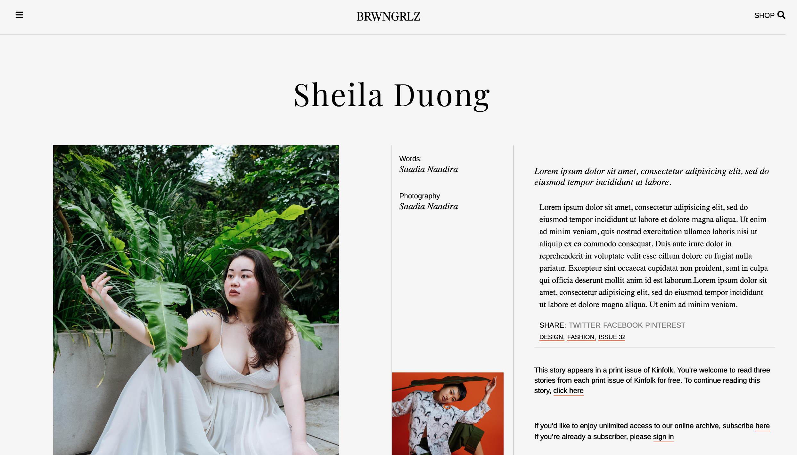

# Kinfolk Website Mockup
This UI mockup is designed similarly to the Kinfolk.com website. It is responsive to mobile, tablet and desktops.

## How it's made:
**Tech Used** I used HTML5, CSS3 and Grid based CSS. The first page utilized floats while the second page was my first attempt at using Flexbox. All images used are my own.

## Lesson Learned
I read the documentation on mdn.com and csstricks.com on how to use Flexbox to work on the second page.It was my first time using Flexbox as most of my familiarity is with floats. I thoroughly enjoyed
the learning process and it allowed me to see the difference between using an older grid based layout technique versus a more modern one. It also gets me excited to build more designs using Flexbox.
